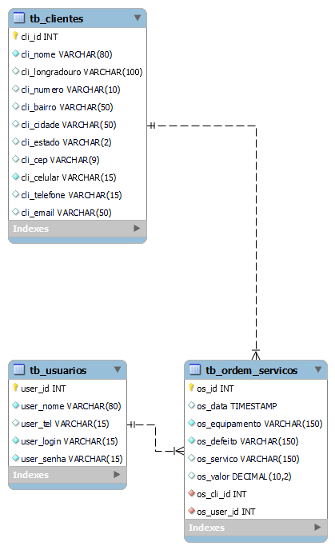

# jbInnovateRepair - Sistema Desktop de Gerenciamento de Ordem de Serviço 


## Visão Geral

O **jbInnovateRepair** é um sistema desktop desenvolvido para facilitar o gerenciamento de Ordens de Serviço (OS) em uma assistência técnica. Com recursos que incluem cadastro de clientes, relatórios de OS, gestão de técnicos e autenticação segura, o sistema visa otimizar o processo administrativo.

## Funcionalidades Principais

1. **Cadastro de Cliente:**
   - Registro completo de informações do cliente, incluindo nome, endereço, contatos (celular, telefone e e-mail).

2. **Cadastro de Ordem de Serviço (OS):**
   - Registro eficiente de OS com detalhes como equipamento, defeito, serviço realizado e valor.
   - A data da OS é salva automaticamente no momento do registro.

3. **Gestão de Técnicos:**
   - Apenas administradores têm acesso à função de cadastrar técnicos.
   - Controle de informações como nome, telefone, login e senha.

4. **Autenticação Segura:**
   - Tela de login com autenticação segura para garantir acesso controlado ao sistema.

## Banco de Dados

O sistema utiliza um banco de dados MySQL com as seguintes tabelas:

1. **Tabela `tb_usuarios`:**
   
2. **Tabela `tb_clientes`:**
   
3. **Tabela `tb_ordem_servicos`:**
   
   

## Capturas de Tela

```markdown

```

## Pré-requisitos e Instalação

1. **Java Development Kit (JDK):** Instale o JDK para garantir a execução adequada do sistema.
2. **MySQL Server:** Certifique-se de ter um servidor MySQL configurado com as tabelas necessárias.

## Como Contribuir

1. Faça um fork do repositório.
2. Clone o fork para o seu ambiente local.
3. Faça suas modificações e melhorias.
4. Envie um pull request para revisão.

## Contato

Para mais informações, entre em contato: [devjbarbosa](www.linkedin.com/in/devjbarbosa)


## Licença

Este projeto é licenciado sob a [Licença Pública Geral GNU](LICENSE) - consulte o arquivo [LICENSE](LICENSE) para obter detalhes.
